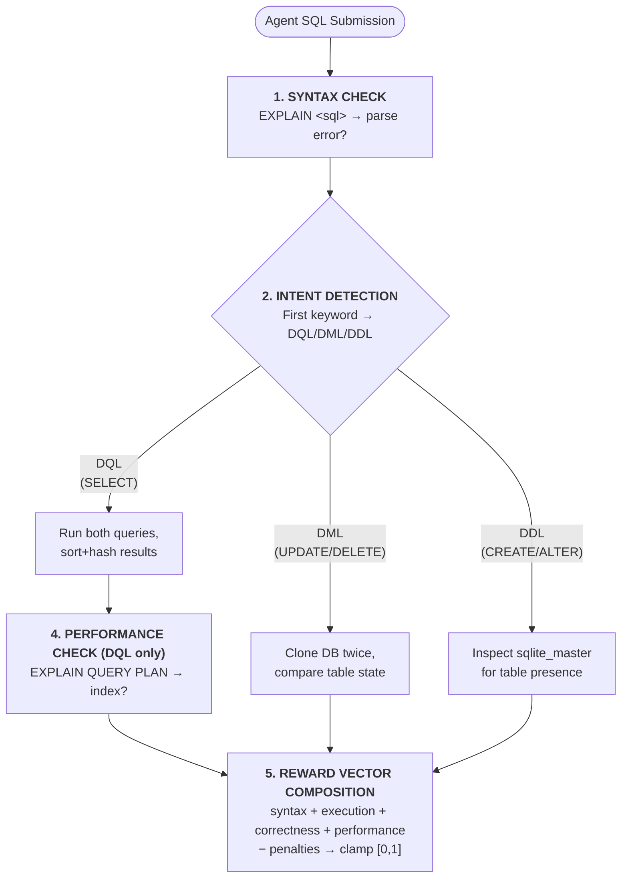

# 🗄️ SQL Review Environment (`sql-review-env`)

> An [OpenEnv](https://github.com/meta-pytorch/OpenEnv)-compliant, enterprise-grade reinforcement learning environment for training and evaluating AI agents on real-world database engineering workflows.

---

## 🔍 Why SQL Review?

**This is not a toy.** SQL query review is one of the most critical, high-volume engineering tasks performed daily by Senior Database Administrators (DBAs) at scale.

In enterprise production systems, **millions of SQL queries** are submitted to databases every day. Before any query reaches production, a DBA must manually verify that it:

1. **Parses correctly** — syntax errors silently break entire application pipelines
2. **Returns the right data** — an off-by-one `WHERE` clause can expose confidential records
3. **Performs efficiently** — a single full-table scan on a billion-row table can bring down a production server
4. **Mutates data safely** — an `UPDATE` without a `WHERE` clause corrupts entire datasets permanently

This environment simulates that **high-stakes engineering workflow** as an RL task. An AI agent acts as a virtual DBA — receiving a broken or inefficient query, reading the live database schema, executing iterative fixes, and receiving dense reward signals that mirror exactly how a human engineer would evaluate quality.

> [!IMPORTANT]
> This environment is designed for agents that must reason over structured data, write syntactically precise code, and optimize for both correctness **and** efficiency — simultaneously. It is directly applicable to training production-ready AI coding assistants.

---

## 🚀 Running the Ultimate Demo

See the Universal Grader in action in **under 60 seconds** — no API key required:

```bash
python demo.py
```

This runs a fully automated, color-formatted terminal showcase proving the grader works live across all three SQL evaluation domains:

| Scenario | Task | What It Demonstrates |
| :--- | :--- | :--- |
| 1 — Self-Correcting Agent | `syntax-fix` | Error bubbling, score clamping at 0.01, then full recovery to 0.99 |
| 2 — Query Optimizer | `performance-tune` | Partial credit for correctness, then `EXPLAIN QUERY PLAN` bonus awarded |
| 3 — Schema Architect | `schema-design` | DDL grading via `sqlite_master` inspection — zero string matching |

> **No mocks. No hardcoded strings.** Every reward is computed live against a real in-memory SQLite database.

---

## 📖 Architecture Overview

The **SQL Review Environment** places an agent in an interactive loop against a **live, isolated, in-memory SQLite database**. The agent must write raw SQL, observe results or errors, then iterate until the query is both correct and efficient.

**Key Architectural Features:**

| Feature | Implementation |
| :--- | :--- |
| **Universal Intent-Based Grader** | Detects SQL intent (DQL/DML/DDL) and applies state-comparison evaluation dynamically |
| **Master Template Cache** | `sqlite3.Connection.backup()` clones the master DB in **< 2ms** per `reset()` |
| **Realistic Fixture Data** | 10,000+ rows across 5 tables, generated via `Faker(seed=42)` for reproducibility |
| **RAM Cap** | `PRAGMA max_page_count = 10000` prevents memory exhaustion attacks |
| **Query Timeout** | `set_progress_handler` aborts runaway queries after **1.5 seconds** |
| **Safety Penalties** | Unguarded `DROP`/`DELETE` commands are penalized without crashing the server |
| **Full OpenEnv Spec** | Typed Pydantic models, all required HTTP endpoints, `openenv validate` passes |

---

## 🎯 Tasks

The environment exposes **6 tasks** spanning the full spectrum of database engineering, progressing from syntax debugging to complex structural design.

| Task ID | Difficulty | Category | Objective | Why This Is Challenging |
| :--- | :---: | :--- | :--- | :--- |
| `syntax-fix` | **Easy** | Debugging | Fix deliberate parse errors (`SELCET`, `WHRE`) | Requires recognizing SQLite-specific syntax vs. other SQL dialects |
| `performance-tune` | **Medium** | Optimization | Rewrite a slow subquery to use indexed JOINs | Agent must understand `EXPLAIN QUERY PLAN` semantics, not just produce correct data |
| `schema-design` | **Hard** | DDL | Design a normalized relational schema from a plain-text requirement | No reference data exists to compare — grader must inspect `sqlite_master` state |
| `aggregation-mastery` | **Medium** | Analytics | Write `GROUP BY` + `HAVING` aggregate query | `HAVING` clause filtering is frequently confused with `WHERE` by LLMs |
| `data-mutation` | **Medium** | DML | Targeted `UPDATE`/`DELETE` with a precise `WHERE` clause | Unguarded mutations are penalized; agent must scope changes correctly |
| `advanced-joins` | **Hard** | Joins | `LEFT JOIN` preserving `NULL` rows for products with no reviews | **NULL preservation** in outer joins is a common failure point for even frontier LLMs |

---

## 🏗️ Universal Grader Architecture

The core innovation is a **single deterministic grading engine** (`sql_env/graders.py`) that handles all 6 task types without any per-task custom logic:



---

## 📊 Interaction Spaces

> [!NOTE]
> All types below are implemented as **Pydantic models** (`sql_env/models.py`) per the OpenEnv typed spec. This ensures schema validation on every API call.

### Observation Space — `SQLObservation`

The full state packet returned to the agent after every `reset()` or `step()`:

| Property | Type | Description |
| :--- | :--- | :--- |
| `task_id` | `str` | Active task (e.g., `"performance-tune"`) |
| `db_schema` | `str` | Human-readable `CREATE TABLE` schema of the live database |
| `query` | `str` | Starting SQL query — often containing deliberate bugs or inefficiencies |
| `expected_hint` | `str` | Natural language description of the agent's goal |
| `error_message` | `str \| None` | Last SQLite exception string from the engine, or `null` if clean |
| `step` | `int` | Current episode step count (`max_steps = 8`) |

### Action Space — `SQLAction`

The single action type the agent submits to the environment:

| Property | Type | Description |
| :--- | :--- | :--- |
| `sql` | `str` | A raw SQL statement to execute against the live SQLite database |

### Reward — `SQLReward`

The structured reward object returned after every `step()`:

| Property | Type | Description |
| :--- | :--- | :--- |
| `value` | `float` | Scalar score clamped to `[0.01, 0.99]` |
| `breakdown` | `dict` | Per-component score vector (see reward table below) |
| `done` | `bool` | Whether the episode has terminated |
| `info` | `dict` | Debug info — includes raw error string, EXPLAIN QUERY PLAN output |

---

## 🏆 Reward Function

The reward function provides **dense partial-progress signals** across every step — not just binary success/failure. This allows RL agents to learn from incremental improvements.

> [!IMPORTANT]
> Scores are strictly clamped to `[0.01, 0.99]`. This avoids dead-zone gradient issues in policy gradient methods — the agent always receives a non-zero learning signal.

### Reward Components

| Component | Max Weight | Trigger |
| :--- | :---: | :--- |
| **Syntax** | `+0.30` | `EXPLAIN <sql>` passes the SQLite parser without error |
| **Execution** | `+0.25` | Query executes against the live DB without a runtime exception |
| **Correctness** | `+0.35` | Sorted, hashed result set (or final table state for DML) matches ground truth |
| **Performance** | `+0.10` | `EXPLAIN QUERY PLAN` confirms an index scan (DQL tasks only) |

### Penalties

| Penalty | Weight | Condition |
| :--- | :---: | :--- |
| Destructive Command | `−0.05` | Unguarded `DROP` or `DELETE` (no `WHERE` clause) |
| Step Exhaustion | `−0.10` | Agent exceeds `max_steps = 8` without solving the task |

---

## 🚀 Getting Started

### Prerequisites

- [Docker](https://docs.docker.com/get-docker/) (for containerized deployment)
- Python 3.11+ (for local development)

### 1. Run via Docker

```bash
# Build the container image
docker build -t sql-review-env .

# Run the environment on port 7860
docker run -p 7860:7860 sql-review-env
```

The Gradio UI and all OpenEnv API endpoints will be available at `http://localhost:7860`.

### 2. Local Python Setup

```bash
# Create and activate virtual environment
python -m venv .venv
.venv\Scripts\activate       # Windows
# source .venv/bin/activate  # Linux / macOS

# Install dependencies
pip install -r requirements.txt

# Start the Gradio UI (demo interface)
python app.py

# OR: Start the raw OpenEnv API server directly
python -m uvicorn server.app:app --host 0.0.0.0 --port 7860
```

### 3. Run the Demo Showcase

```bash
# No API key needed — runs purely against local SQLite
python demo.py
```

### 4. Run the LLM Inference Script

```bash
# Set credentials (at least one is required)
export HF_TOKEN="hf_your_token_here"
# OR: export OPENAI_API_KEY="sk-your_key_here"

# Optional overrides
export API_BASE_URL="https://router.huggingface.co/v1"
export MODEL_NAME="Qwen/Qwen2.5-72B-Instruct"

# Run the evaluation loop across all tasks
python inference.py
```

**Structured stdout output format (required by OpenEnv spec):**

```
[START] task=syntax-fix env=sql-review-env model=Qwen/Qwen2.5-72B-Instruct
[STEP]  step=1 action=SELECT * FROM users reward=0.55 done=false error=null
[STEP]  step=2 action=SELECT id, name FROM users WHERE ... reward=0.99 done=true error=null
[END]   success=true steps=2 score=0.990 rewards=0.55,0.99
```

---

## 📈 Baseline Scores

Results achieved using the zero-shot baseline agent (`Qwen/Qwen2.5-72B-Instruct`, max 8 steps):

| Task | Score | Observation |
| :--- | :---: | :--- |
| `syntax-fix` | **0.99** | Solved in 1 step consistently (grader clamps max reward to `0.99`) |
| `performance-tune` | **0.90** | Correctness achieved; occasional index miss costs the `+0.10` bonus |
| `schema-design` | **0.90** | Frontier models sometimes hallucinate MySQL syntax (`AUTO_INCREMENT` instead of SQLite's `AUTOINCREMENT`) |
| `aggregation-mastery` | **0.85** | `GROUP BY` solid; `HAVING` clause occasionally omitted |
| `data-mutation` | **0.85** | `UPDATE` correctness solid; scoping precision varies |
| `advanced-joins` | **0.75** | `NULL` preservation in `LEFT JOIN` is the primary failure mode |

> [!NOTE]
> These scores are fully reproducible. Run `python inference.py` with your API credentials against the included environment. The dataset is pinned via `Faker(seed=42)` and `random.seed(42)` — every run produces an identical database state.

---

## 📁 Project Structure

```
sql-review-env/
├── app.py                  # Gradio UI entry point (interactive demo)
├── demo.py                 # Automated end-to-end showcase script (run this first!)
├── inference.py            # OpenEnv-compliant LLM evaluation agent
├── requirements.txt        # Python dependencies
├── pyproject.toml          # Project metadata + entry_point: server.app:main
├── uv.lock                 # Deterministic dependency lockfile (uv)
├── openenv.yaml            # OpenEnv environment metadata declaration
├── Dockerfile              # Container: python:3.11-slim + uvicorn + proxy headers
├── validate-submission.sh  # Local pre-submission validation runner
├── README.md               # This document
├── server/
│   └── app.py              # FastAPI server: /reset /step /state /health /metadata /schema /mcp
└── sql_env/
    ├── models.py           # Pydantic typed models: SQLObservation, SQLAction, SQLReward
    ├── env.py              # Core environment: reset(), step(), state() + safety constraints
    ├── graders.py          # Universal Intent-Based Grader (DQL / DML / DDL routing)
    └── tasks.py            # 6 task definitions + Master DB template cache
```

---

## ✅ OpenEnv Spec Compliance

| Requirement | Status | Detail |
| :--- | :---: | :--- |
| `/reset` endpoint | ✅ | `POST` — accepts `task_id`, returns `SQLObservation` |
| `/step` endpoint | ✅ | `POST` — accepts `SQLAction`, returns `SQLReward` |
| `/state` endpoint | ✅ | `GET` — returns current episode state dict |
| `/health` endpoint | ✅ | `GET` — returns `{"status": "healthy"}` |
| `/metadata` endpoint | ✅ | `GET` — returns name, description, version, task list |
| `/schema` endpoint | ✅ | `GET` — returns full action/observation/state JSON schemas |
| `/mcp` endpoint | ✅ | `POST` — returns JSON-RPC 2.0 compliant payload |
| Typed Pydantic models | ✅ | `SQLObservation`, `SQLAction`, `SQLReward` |
| `openenv.yaml` present | ✅ | Declares `entry_point: server.app:main` with 6 tasks |
| `openenv validate` passes | ✅ | All automated checks pass |
| `docker build` succeeds | ✅ | `python:3.11-slim`, clean build, port 7860 |
| Minimum 3 tasks | ✅ | 6 tasks implemented (Easy → Hard) |
| Score range `[0.0, 1.0]` | ✅ | Clamped to `[0.01, 0.99]` |
| Inference script present | ✅ | `inference.py` in root, uses OpenAI client |
| Structured stdout logs | ✅ | `[START]` / `[STEP]` / `[END]` format strictly followed |
| Reproducible scores | ✅ | `Faker(seed=42)` + `random.seed(42)` pinned |
