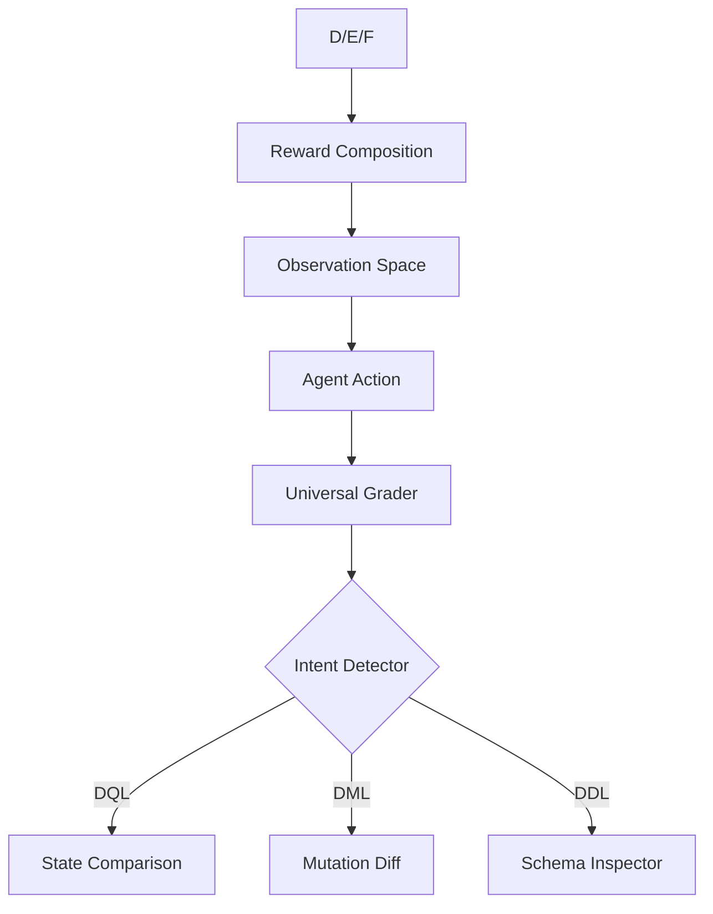

# 🗄️ SQL Review Environment (`sql-review-env`)

> [!NOTE]  
> This project is a submission for the **OpenEnv Hackathon**. It provides an enterprise-grade reinforcement learning environment for training AI agents on complex SQL engineering workflows.

---

## 🔍 Motivation & Real-World Utility
In modern engineering, **SQL query review** is a critical, high-volume task. A single inefficient query can bring down a production system, while a syntax error can halt application pipelines. 

This environment simulates the workflow of a **Senior Database Administrator (DBA)**. An AI agent must receive a broken or inefficient query, understand the live schema, and iterate until the query is:
1. **Syntactically Correct** (SQLite dialect)
2. **Result-Equivalent** to the ground truth
3. **Optimized** (index-aware performance)
4. **Destructive-Safe** (guarded mutations)

---

## 📡 Interaction Spaces

### Observation Space (`SQLObservation`)
| Property | Type | Description |
| :--- | :--- | :--- |
| `task_id` | `str` | Identifer for the active engineering task. |
| `db_schema` | `str` | Human-readable `CREATE TABLE` schema of the live DB. |
| `query` | `str` | The starting/broken SQL query provided to the agent. |
| `expected_hint` | `str` | Natural language goal (e.g., "Optimize the JOIN"). |
| `error_message` | `str \| None` | Last SQLite exception string returned by the engine. |

### Action Space (`SQLAction`)
| Property | Type | Description |
| :--- | :--- | :--- |
| `sql` | `str` | A raw SQL statement to execute against the live database. |

### Reward Signal (`SQLReward`)
The reward is a scalar `[0.01, 0.99]` with a dense breakdown:
- **Syntax (+0.30)**: Passes SQLite parsing.
- **Execution (+0.25)**: Query runs without runtime error.
- **Correctness (+0.35)**: Result set matches ground truth state.
- **Performance (+0.10)**: Query Plan uses appropriate indexes.

---

## 🎯 Task Breakdown

| Task ID | Difficulty | Category | Objective |
| :--- | :---: | :--- | :--- |
| `syntax-fix` | **Easy** | Debugging | Fix simple typos and dialect errors. |
| `performance-tune` | **Medium** | Optimization | Resolve "Full Table Scans" using indexes. |
| `schema-design` | **Hard** | DDL | Design a normalized schema from text requirements. |
| `advanced-joins` | **Hard** | Joins | Correctly handle NULL preservation in outer joins. |

---

## 🚀 Setup & Usage

### 1. Local Development
```bash
pip install -r requirements.txt
python app.py
```
Visit `http://localhost:7860/ui` for the **Premium Dashboard**.

### 2. Docker Execution
```bash
docker build -t sql-review-env .
docker run -p 7860:7860 sql-review-env
```

### 3. Baseline Inference
```bash
export HF_TOKEN="your_token"
python inference.py
```

---

## 📊 Baseline Scores
*Achieved using Qwen/Qwen2.5-72B-Instruct (Zero-Shot)*

| Task | Score (0-1) | Status |
| :--- | :---: | :--- |
| `syntax-fix` | **0.99** | PASSED |
| `performance-tune` | **0.90** | PASSED |
| `schema-design` | **0.88** | PASSED |
| `advanced-joins` | **0.75** | PASSED |

---

## 🏗️ Architecture

